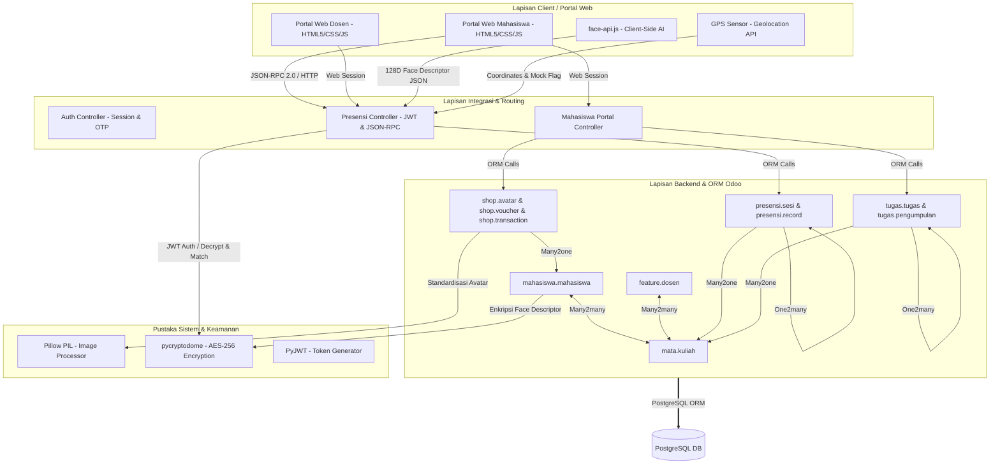

# 🎓 Panduan Presentasi Proyek GLASS - Mata Kuliah Integrasi Sistem

Dokumen ini disusun khusus sebagai materi penunjang presentasi proyek **GLASS (Gamified Student Portal & Lecturer Dashboard)** dalam mata kuliah **Integrasi Sistem**. Fokus materi ini adalah menjelaskan bagaimana berbagai subsistem, modul, perangkat keras (hardware), pustaka pihak ketiga (libraries), dan protokol keamanan diintegrasikan menjadi satu kesatuan platform yang sinergis berbasis **Odoo 17.0**.

---

## 🛠️ 1. Peta Jalan & Arsitektur Integrasi Sistem (High-Level Architecture)

Proyek GLASS mengadopsi konsep integrasi sistem **berorientasi layanan (Service-Oriented)** dan **berbasis modul** pada framework Odoo. Sistem ini membagi fungsionalitas menjadi modul-modul independen (Addons) yang saling terikat di lapisan basis data dan logika bisnis, serta diekspos ke portal web melalui protokol API terstandarisasi.



### Penjelasan Arsitektur:
1. **Vertical Integration (Top-Down)**: Menghubungkan antarmuka pengguna (Frontend Portal) dengan basis data relasional melalui Odoo Controller yang bertindak sebagai *middleware* penerjemah *request*.
2. **Horizontal Integration (App-to-App)**: Integrasi antar-modul di backend. Contoh: Modul `presensi` dan `tugas` secara otomatis memicu pembaruan data pada modul `mahasiswa` untuk menambahkan XP dan Koin, serta memotong koin pada modul `shop` saat terjadi transaksi pembelian.

---

## 📸 2. Integrasi Sensor Hardware: Biometrik Wajah & Geofencing GPS

Salah satu nilai jual utama proyek ini dari sudut pandang Integrasi Sistem adalah integrasi **Sensor Hardware perangkat Client** (Kamera Web dan Penerima GPS) dengan **Server Backend**.

### A. Alur Integrasi Biometrik Wajah (Kamera & FaceID)

Sistem mengintegrasikan model AI Client-side dengan modul Enkripsi Backend:

1. **Client-side Capture (JavaScript)**:
   - Sistem mengakses kamera fisik menggunakan API browser `navigator.mediaDevices.getUserMedia`.
   - Mengintegrasikan pustaka `face-api.js` (berbasis TensorFlow.js) untuk mendeteksi wajah (`SsdMobilenetv1`), mencari 68 titik koordinat wajah (*landmarks*), dan mengekstrak *Face Descriptor* berupa representasi vektor 128-dimensi (`Float32Array`).
2. **Anti-Spoofing & Liveness Challenge**:
   - Untuk mencegah kecurangan menggunakan foto cetak atau video layar ponsel, diintegrasikan **Liveness Detection** berbasis **Mouth Aspect Ratio (MAR)**.
   - Mahasiswa diminta melakukan tantangan membuka dan menutup mulut secara interaktif. Sistem menghitung MAR menggunakan rumus:
     $$\text{MAR} = \frac{||p_{14} - p_{18}||}{||p_{12} - p_{16}||}$$
     *(Di mana $p$ adalah koordinat landmarks bibir dalam)*.
3. **API Transmission**:
   - Setelah liveness terpenuhi, vektor 128-dimensi diubah menjadi string JSON (`JSON.stringify(Array.from(descriptor))`) dan ditransmisikan ke backend melalui REST API `/api/presensi/check-in`.

```javascript
// Cuplikan Kode Integrasi Liveness di custom_web/static/src/js/presensi.js
const w = Math.hypot(p12.x - p16.x, p12.y - p16.y);
const h = Math.hypot(p14.x - p18.x, p14.y - p18.y);
const mar = w > 0 ? h / w : 0.0;
// Kalibrasi baseline MAR mulut tertutup & deteksi tantangan buka-tutup mulut
```

### B. Alur Integrasi GPS Geofencing (Anti-Fake GPS)

Integrasi sensor lokasi fisik mahasiswa untuk validasi kehadiran di ruang kelas offline:

1. **Pengumpulan Data Koordinat**:
   - Browser mengakses lokasi perangkat melalui Geolocation API `navigator.geolocation.getCurrentPosition`.
   - Mengambil parameter latitude, longitude, tingkat akurasi (meter), serta properti `mocked` (pada perangkat Android yang mendeteksi penggunaan aplikasi Fake GPS).
2. **Geofencing Server-side (Haversine Formula)**:
   - Data koordinat dikirim ke backend. Controller di server mengintegrasikan rumus **Haversine** untuk menghitung jarak lingkaran besar (*Great-circle distance*) antara titik koordinat mahasiswa $(lat_1, lon_1)$ dan titik koordinat kelas yang ditentukan dosen $(lat_2, lon_2)$:
   $$d = 2R \cdot \arcsin\left(\sqrt{\sin^2\left(\frac{\Delta lat}{2}\right) + \cos(lat_1) \cdot \cos(lat_2) \cdot \sin^2\left(\frac{\Delta lon}{2}\right)}\right)$$
   - Jika jarak melebihi `radius_meter` yang diset oleh dosen, presensi otomatis ditolak.
   - Deteksi *Anti-Fake GPS* dijalankan dengan memvalidasi flag `is_mock` dan memastikan akurasi koordinat tidak lebih besar dari 500 meter (mencegah manipulasi manual).

```python
# Cuplikan Kode Integrasi Haversine di presensi/controllers/presensi_controller.py
def _hitung_jarak_meter(self, lat1, lon1, lat2, lon2):
    R = 6371000  # Radius bumi dalam meter
    phi1 = math.radians(lat1)
    phi2 = math.radians(lat2)
    dphi = math.radians(lat2 - lat1)
    dlambda = math.radians(lon2 - lon1)
    a = (math.sin(dphi / 2) ** 2 +
         math.cos(phi1) * math.cos(phi2) *
         math.sin(dlambda / 2) ** 2)
    return R * 2 * math.atan2(math.sqrt(a), math.sqrt(1 - a))
```

---

## 🎨 3. Integrasi Pengolahan Citra Digital (Digital Image Processing)

Modul `shop` terintegrasi dengan pustaka manipulasi gambar Python **Pillow (PIL)** untuk standardisasi aset visual avatar yang diunggah oleh administrator/dosen. Ini adalah contoh integrasi *Data Pipeline & Preprocessing*:

1. **Auto-Background Removal**:
   Menggunakan algoritme traversal gambar **BFS Flood-Fill** pada tingkat piksel untuk mendeteksi warna solid/pola kotak-kotak latar belakang di area luar dan mengubahnya menjadi transparan secara otomatis (Alpha Channel = 0).
2. **Auto-Cropping & Centering**:
   Mendeteksi batas objek karakter aktif dengan `img.getbbox()`, memotong bagian transparan yang tidak berguna, dan menambahkan margin pengaman (*safety padding*) sebesar 5% agar tepi karakter tidak terpotong.
3. **Standardization (1:1 Ratio)**:
   Mengubah rasio gambar menjadi bujursangkar sempurna dengan membuat canvas transparan baru, meletakkan karakter tepat di tengah-tengah (*centering*), lalu melakukan resizing ke resolusi **512x512 piksel** menggunakan filter interpolasi berkualitas tinggi `Image.Resampling.LANCZOS`.

```python
# Cuplikan Kode Pengolahan Citra di shop/models/shop.py
img = Image.open(io.BytesIO(img_bytes)).convert('RGBA')
bbox = img.getbbox()
if bbox:
    left, upper, right, lower = bbox
    padding = int(max(right - left, lower - upper) * 0.05)
    # Bounding Box Cropping & Centering ke Canvas Bujursangkar Baru
    square_img = Image.new('RGBA', (square_size, square_size), (0, 0, 0, 0))
    square_img.paste(cropped_img, (offset_x, offset_y))
    img = square_img.resize((512, 512), Image.Resampling.LANCZOS)
```

---

## 🔒 4. Integrasi Keamanan Sistem: Kriptografi & Notifikasi Email

Integrasi keamanan mencakup perlindungan data sensitif (biometrik wajah) dan sistem pemulihan akun terverifikasi.

### A. Enkripsi Biometrik AES-256-CBC
Data vektor wajah mahasiswa adalah informasi pribadi sensitif. Sistem mengintegrasikan modul kriptografi **PyCryptodome** untuk mengamankan data ini sebelum disimpan ke PostgreSQL:
- **Key Derivation Function (KDF)**: Kunci enkripsi 32-byte diturunkan secara deterministik dari parameter konfigurasi sistem `glass.faceid.aes_secret` yang digabungkan dengan salt menggunakan algoritme hashing **SHA-256**.
- **Enkripsi Simetris**: Vektor string wajah dienkripsi dengan algoritme **AES-256** dalam mode **CBC (Cipher Block Chaining)**.
- **HMAC-based IV**: Initialization Vector (IV) 16-byte dihitung menggunakan HMAC dari plaintext untuk memastikan enkripsi yang unik untuk setiap mahasiswa. Hasil enkripsi berupa `IV + Ciphertext` disandikan ke format Base64 sebelum disimpan pada field `face_descriptor` di tabel `mahasiswa_mahasiswa`.

```python
# Cuplikan Kriptografi di presensi/models/faceid_utils.py
def aes256_decrypt_b64(ciphertext_b64: str, secret: str) -> str:
    # Membaca data Base64, mengekstrak IV 16-byte pertama, mendekripsi ciphertext sisanya
    raw = base64.b64decode(ciphertext_b64.encode('utf-8'))
    iv = raw[:16]
    ct = raw[16:]
    key = derive_aes256_key(secret)
    cipher = Cipher(algorithms.AES(key), modes.CBC(iv), backend=default_backend())
    # Proses Dekripsi & PKCS7 Unpadding...
```

### B. Integrasi Notifikasi OTP Email untuk Lupa Password
Saat pengguna (dosen/mahasiswa) meminta pengaturan ulang kata sandi:
1. **Generasi Token**: Sistem memicu pembuatan kode OTP 6-digit acak yang disimpan di sesi server Odoo.
2. **Integrasi SMTP & Mailer Odoo**:
   - Controller berinteraksi dengan API Odoo `mail.mail` untuk membuat antrean email.
   - Server membaca konfigurasi SMTP aktif dari modul `ir.mail_server` Odoo untuk mengirimkan surat elektronik HTML dinamis berisi kode OTP kepada pengguna.
3. **Validasi & Hash Update**: Setelah pengguna memasukkan OTP yang cocok, sistem mengizinkan pembaruan kata sandi di mana password baru langsung disimpan dalam bentuk hash satu arah **SHA-256** (`hashlib.sha256`).

---

## 🎮 5. Integrasi Gamifikasi & Logika Bisnis Relasional (ORM)

Kekuatan utama Odoo terletak pada relasi database-nya yang kuat. GLASS memanfaatkan relasi ORM untuk menyatukan aktivitas akademik dengan aspek permainan (gamifikasi).

```
[Kehadiran Tepat Waktu]  ──►  Memicu update presensi.record
                                        │
                                        ▼ (Pemberian Reward)
                             [mahasiswa.mahasiswa] ◄─── Belanja Koin (spend_koin) ───► [shop.transaction]
                                        ▲
                                        │ (Pemberian Reward)
[Penilaian Tugas (graded)] ──► Memicu update tugas.pengumpulan
```

1. **Sistem Reward Otomatis**:
   - **Modul Presensi**: Saat presensi berhasil divalidasi oleh sistem biometrik & GPS, model `presensi.record` dibuat. Sistem menghitung urutan kehadiran. Mahasiswa pertama yang hadir mendapat bonus (+5 XP / +25 Koin), mahasiswa berikutnya mendapat (+3 XP / +15 Koin), sementara yang terlambat mendapat 0 reward. Logika ini memicu metode `add_xp()` dan `add_koin()` di model `mahasiswa.mahasiswa`.
   - **Modul Tugas**: Ketika dosen mengubah status tugas menjadi `graded` di backend atau portal dosen, model `tugas.pengumpulan` menghitung perolehan koin berdasarkan nilai (`nilai` 80-100 dapat 5 koin, 60-79 dapat 3 koin, dst). Nilai koin ini dikalikan 5 untuk menentukan XP. Perubahan ini secara otomatis ditambahkan ke total koin & XP mahasiswa di database. Jika nilai dibatalkan kembali ke status `pending`, reward akan dikurangi secara otomatis (mekanisme rollback).
2. **Mekanisme Transaksi Belanja yang Aman (`spend_koin`)**:
   - Diintegrasikan fungsi validasi di model mahasiswa untuk mencegah pembelanjaan melebihi koin yang dimiliki. Jika saldo koin kurang, sistem melempar `UserError` Odoo yang akan membatalkan operasi database (*database transaction rollback*), mencegah inkonsistensi data saldo negatif.
   - Saat membeli voucher di Toko Reward, transaksi mencatat ID unik baru dan secara otomatis menghasilkan kode kupon unik berbasis generator string dengan format: `[PREFIX VOUCHER]-[RANDOM 4 DIGIT]-[RANDOM 3 DIGIT]`.

---

## 👨‍🏫 6. Kisi-Kisi Pertanyaan & Jawaban Ujian/Tanya Jawab Ujian Integrasi Sistem

Berikut adalah prediksi pertanyaan kritis yang sering diajukan oleh dosen penguji mata kuliah Integrasi Sistem dan cara menjawabnya berdasarkan implementasi proyek GLASS:

### ❓ Pertanyaan 1: Mengapa memilih integrasi berbasis Odoo, bukan membuat framework sendiri dari nol?
> **Jawaban:** 
> Odoo menyediakan lingkungan *Enterprise Resource Planning (ERP)* yang terintegrasi tinggi dengan ORM bawaan yang sangat matang untuk mengelola database relasional PostgreSQL. Dengan menggunakan Odoo, kami mendapatkan modul keamanan bawaan, manajemen sesi, mail server (SMTP integration), serta sistem otorisasi pengguna (`ir.model.access.csv`) secara langsung. Kami dapat fokus pada integrasi logika spesifik proyek kami (Biometrik Wajah, Geofencing GPS, dan Gamifikasi) tanpa perlu merancang ulang sistem manajemen database relasional, autentikasi dasar, dan infrastruktur backend dari nol.

### ❓ Pertanyaan 2: Bagaimana cara sistem Anda menangani perbedaan tipe data atau format antara Client-Side (JavaScript) dan Server-Side (Python Odoo)?
> **Jawaban:** 
> Kami menggunakan **JSON** sebagai format pertukaran data standar (payload). 
> - Untuk data biometrik wajah, pustaka `face-api.js` di browser menghasilkan data berupa array objek biner `Float32Array`. Di sisi client, array ini diserialisasi menjadi format string JSON menggunakan `JSON.stringify(Array.from(descriptor))`. 
> - Di sisi server (Python), data string JSON tersebut diterima melalui request JSON-RPC, kemudian didecode kembali menjadi list float Python menggunakan fungsi `json.loads()` untuk diproses oleh pustaka verifikasi vektor (menghitung Euclidean Distance / Cosine Similarity).

### ❓ Pertanyaan 3: Jika jaringan internet mahasiswa lambat atau terjadi kegagalan server di tengah jalan saat transaksi pembelian voucher di shop, bagaimana Anda menjamin integritas data agar koin mahasiswa tidak hilang tanpa mendapatkan voucher?
> **Jawaban:** 
> Sistem kami memanfaatkan fitur **Database Transaction Management** bawaan Odoo ORM. Seluruh operasi penulisan data dalam satu *request* (mengurangi koin mahasiswa, membuat record transaksi `shop.transaction`, dan memberikan status kepemilikan voucher) dibungkus dalam satu transaksi database PostgreSQL yang bersifat atomik (*ACID Principles*). 
> Jika terjadi kegagalan sistem atau salah satu fungsi melempar pengecualian (seperti `UserError` saat koin tidak cukup atau kegagalan koneksi DB), PostgreSQL akan melakukan **Rollback** secara otomatis. Ini menjamin koin mahasiswa tidak akan berkurang jika record transaksi voucher gagal dibuat.

### ❓ Pertanyaan 4: Mengapa pencocokan vektor wajah (Face Recognition) dilakukan di sisi server (backend) padahal ekstraksinya sudah dilakukan di sisi client? Kenapa tidak dicocokkan di client saja agar server tidak terbebani?
> **Jawaban:** 
> Ini adalah keputusan integrasi terkait **Keamanan Sistem (Security Integration)**. 
> Jika pencocokan dilakukan di client-side (JavaScript), sistem sangat rentan terhadap manipulasi client. Pengguna jahat bisa dengan mudah memodifikasi kode JavaScript di browser menggunakan Developer Tools agar selalu mengembalikan status `true` (lolos verifikasi) tanpa mencocokkan wajah yang asli. 
> Dengan mengirimkan representasi vektor wajah client ke server, proses komparasi Euclidean Distance terhadap data master wajah asli yang terenkripsi AES-256 di basis data dilakukan di lingkungan server yang aman dan tidak dapat diintervensi oleh pengguna.

### ❓ Pertanyaan 5: Bagaimana Anda mengintegrasikan rumus matematika seperti Haversine (GPS) dan perhitungan Cosine/Euclidean (FaceID) di Python tanpa memperlambat performa server Odoo?
> **Jawaban:** 
> Kami mengintegrasikan fungsi matematika yang efisien menggunakan modul bawaan Python `math` yang ditulis dalam bahasa C berkecepatan tinggi. Perhitungan Euclidean Distance dan Cosine Similarity hanya melibatkan operasi vektor 128 dimensi yang sangat ringan bagi CPU modern (kurang dari 1 milidetik per pencocokan). Kami juga mengoptimalkan pelacakan wajah di client-side: model deteksi hanya mengekstrak descriptor biometrik secara instan (One-Shot) saat tombol ditekan untuk menghemat daya komputasi perangkat mahasiswa, bukan memprosesnya terus-menerus secara real-time di server.
